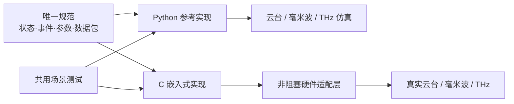
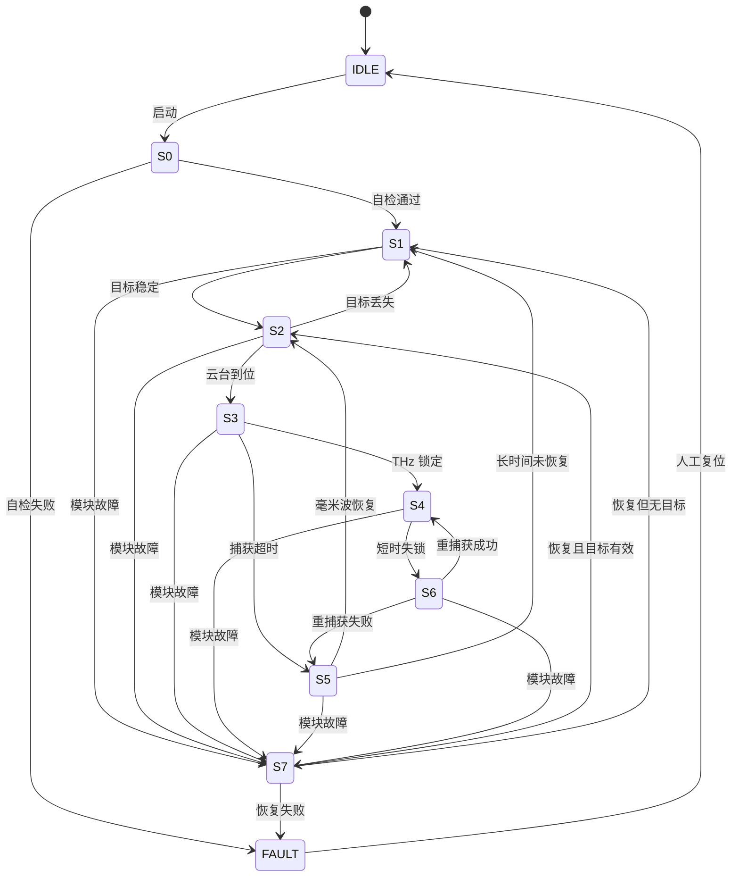

# DSP 状态机仿真统一合并计划

> 目标：统一状态机规则，使 Python 仿真与 STM32 C 实现行为一致，再接入真实硬件。  

## 1. 总体思路

| 模块 | 定位 | 合并后作用 |
|---|---|---|
| `dsp_simulator` | PC 五进程仿真 | Python 参考实现、设备模拟、日志和可视化 |
| XXT 分支 | STM32 状态机原型 | 纯 C 状态机、S6 重捕获、S7 模块恢复 |
| `duojicode` | 云台硬件调试 | RS485/Pelco-D 及其他真实硬件适配 |

不直接拼接 Python 和 C 工程，而是共用一份规范和测试场景。



## 2. 三阶段路线

| 阶段 | 核心工作 | 交付物 | 完成标准 |
|---|---|---|---|
| 一、统一规范 | 冻结状态、事件、单位、阈值和超时 | 状态转移表、协议表、参数表 | Python 和 C 不再各自定义 |
| 二、双端对齐 | Python 补齐 S6/S7，XXT 提取纯 C 核心 | 两种实现、共用场景集 | 逐 slot 状态和输出一致 |
| 三、集成落地 | 保留 Git 历史，接入非阻塞硬件适配器 | 集成分支、联调版本、测试报告 | 仿真和硬件路径均通过 |

## 3. 统一状态机

| 状态 | 含义 |
|---|---|
| `IDLE` | 等待启动 |
| `S0` | 模块自检 |
| `S1` | 毫米波搜索 |
| `S2` | 云台粗对准 |
| `S3` | THz 捕获 |
| `S4` | THz 跟踪与微调 |
| `S5` | 毫米波回退 |
| `S6` | THz 快速重捕获 |
| `S7` | 故障模块恢复 |
| `FAULT` | 无法自动恢复 |



| 项目 | 统一规范 |
|---|---|
| slot | 默认 `100 ms / 10 Hz`，允许配置 |
| 角度 | `int32_t angle_mdeg`，单位 `0.001 deg` |
| 质量 | `0..1000` 整数 |
| 有效性 | 输入带 `valid/seq/age_slots` |
| 时间参数 | 状态机内使用 slot 数 |
| 事件优先级 | 模块故障 > 目标丢失 > 到位/锁定 > 超时 |

## 4. 双端对齐重点

| 对象 | 必须完成 |
|---|---|
| Python | 增加 S6/S7；统一整数单位；修复 S5 恢复判决；持续刷新移动目标 |
| C 核心 | 从 HAL、USART、Keil 和串口日志中解耦；每步只读输入、更新状态、产生输出 |
| 适配层 | 命令队列 + 异步收发 + 下一 slot 更新快照，禁止阻塞状态机 |
| 测试 | 同一场景分别输入 Python/C，逐 slot 比较状态、原因和命令 |

```c
void Fsm_Init(fsm_context_t *ctx, const fsm_config_t *cfg);
void Fsm_Step(fsm_context_t *ctx,
              const fsm_input_t *input,
              fsm_output_t *output);
```

核心场景：正常路径、捕获超时、跟踪失锁、重捕获成功/失败、毫米波恢复、模块恢复和恢复失败。

## 5. 集成与 Git 策略

```text
state_machine/   规范 + Python 核心 + C 核心 + 共用测试
dsp_simulator/   设备仿真 + PC 界面 + 日志/回放
duoji/duojicode/ 云台、毫米波和 THz 硬件适配器
```

- 先提取 XXT 纯 C 核心，不整体迁移重复驱动和 CMSIS 示例。
- 一致性测试通过后，在 `feature/unified-state-machine` 集成。
- 最终使用 `--no-ff` 合并，保留 XXT 作者信息和历史。
- 迁移完成后，`duoji/xxt` 不再单独演进。

## 6. 验收标准

| 验收项 | 标准 |
|---|---|
| 行为一致 | Python/C 在相同输入下逐 slot 结果一致 |
| 转移覆盖 | `S0-S7` 所有入口、出口和 FAULT 有测试 |
| 实时性 | 状态机不被串口或网络等待阻塞 |
| 故障恢复 | S6/S7 可重复验证，无异常循环 |
| 可追溯 | 每次转移均有输入、原因和输出记录 |
| 硬件闭环 | 云台、毫米波和 THz 真实适配器通过联调 |

最终形成“一份规范、两种等价实现、三类硬件适配”的统一状态机体系。
