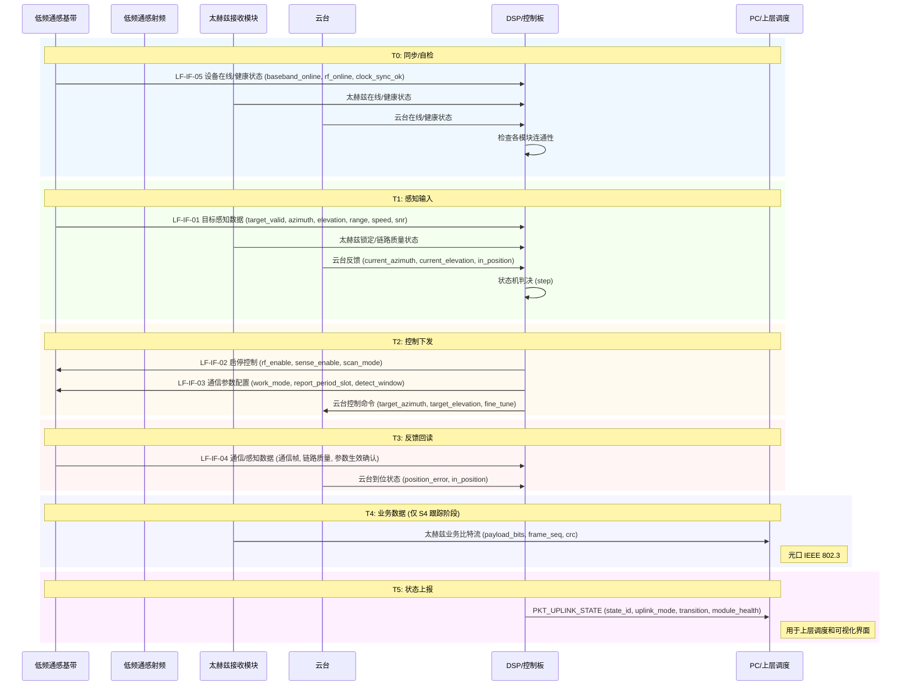

# Slot 内时序流程图

```mermaid
sequenceDiagram
    participant LF as 低频通感基带
    participant RF as 低频通感射频
    participant THZ as 太赫兹接收模块
    participant GIM as 云台
    participant DSP as DSP/控制板
    participant PC as PC/上层调度

    rect rgb(240, 248, 255)
        Note over LF,PC: T0: 同步/自检
        LF->>DSP: LF-IF-05 设备在线/健康状态 (baseband_online, rf_online, clock_sync_ok)
        THZ->>DSP: 太赫兹在线/健康状态
        GIM->>DSP: 云台在线/健康状态
        DSP->>DSP: 检查各模块连通性
    end

    rect rgb(245, 255, 240)
        Note over LF,PC: T1: 感知输入
        LF->>DSP: LF-IF-01 目标感知数据 (target_valid, azimuth, elevation, range, speed, snr)
        THZ->>DSP: 太赫兹锁定/链路质量状态
        GIM->>DSP: 云台反馈 (current_azimuth, current_elevation, in_position)
        DSP->>DSP: 状态机判决 (step)
    end

    rect rgb(255, 250, 240)
        Note over LF,PC: T2: 控制下发
        DSP->>LF: LF-IF-02 启停控制 (rf_enable, sense_enable, scan_mode)
        DSP->>LF: LF-IF-03 通信参数配置 (work_mode, report_period_slot, detect_window)
        DSP->>GIM: 云台控制命令 (target_azimuth, target_elevation, fine_tune)
    end

    rect rgb(255, 245, 245)
        Note over LF,PC: T3: 反馈回读
        LF->>DSP: LF-IF-04 通信/感知数据 (通信帧, 链路质量, 参数生效确认)
        GIM->>DSP: 云台到位状态 (position_error, in_position)
    end

    rect rgb(245, 245, 255)
        Note over LF,PC: T4: 业务数据 (仅 S4 跟踪阶段)
        THZ->>PC: 太赫兹业务比特流 (payload_bits, frame_seq, crc)
        Note right of PC: 光口 IEEE 802.3
    end

    rect rgb(255, 240, 255)
        Note over LF,PC: T5: 状态上报
        DSP->>PC: PKT_UPLINK_STATE (state_id, uplink_mode, transition, module_health)
        Note right of PC: 用于上层调度和可视化界面
    end
```
