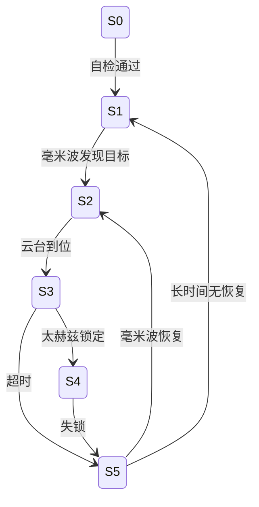
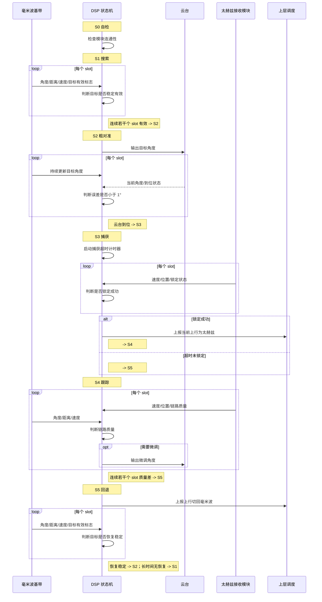

# 瞄捕状态机设计文档

---

## 一、设计架构

### 1.1 硬件接口图

### 1.2 接口信息图

### 1.3 接口说明

| 接口 | 方向 | 传输内容 | 用途 |
|------|------|----------|------|
| 毫米波感知接口 | 毫米波基带 -> DSP | 角度、距离、速度、目标有效标志 | 搜索目标、粗对准、回退后恢复 |
| 太赫兹状态接口 | 太赫兹接收模块 -> DSP | 速度、位置、锁定状态、链路质量 | 判断捕获成功、跟踪质量和失锁 |
| 云台控制接口 | DSP -> 云台 | 目标方位角、俯仰角、微调命令 | 粗对准和跟踪微调 |
| 云台反馈接口 | 云台 -> DSP | 当前角度、到位状态 | 判断是否完成转向 |
| 上行链路状态接口 | DSP -> 上层调度 | 当前上行模式、失锁/恢复状态 | 上行在毫米波与太赫兹之间切换 |

---

## 二、状态机流程 MVP

### 2.1 状态机图

### 2.2 状态定义

| 状态 | 含义 | 主要动作 | 进入下一状态条件 |
|------|------|----------|------------------|
| S0 | 自检 | 检查毫米波、太赫兹、云台和 DSP 接口连通性 | 各模块正常 |
| S1 | 搜索 | 等待毫米波感知发现目标 | 连续若干个 slot 检测到有效目标 |
| S2 | 粗对准 | DSP 根据毫米波目标角度控制云台转向 | 云台误差 < 设定值 |
| S3 | 捕获 | 等待太赫兹上行链路完成锁定 | 锁定成功 / 超时 |
| S4 | 跟踪 | 监控太赫兹链路质量并按需微调云台 | 连续若干个 slot 质量差 -> S5 |
| S5 | 回退 | 上行切回毫米波模式，并继续利用毫米波感知恢复 | 毫米波稳定恢复 -> S2；长时间无恢复 -> S1 |

### 2.3 流程文字说明

1. `S0 自检`
   DSP 上电后检查毫米波接口、太赫兹接口、云台通信和本地状态机模块是否正常，确认后进入搜索状态。

2. `S1 搜索`
   系统持续按 slot 读取毫米波感知结果。当连续若干个 slot 检测到稳定目标时，认为目标有效，进入粗对准阶段。

3. `S2 粗对准`
   DSP 根据毫米波输出的目标角度控制云台转向，并读取云台反馈角度。当云台指向误差收敛到阈值内时，进入太赫兹捕获阶段。

4. `S3 捕获`
   在云台已经粗对准的前提下，等待太赫兹上行链路锁定。如果在设定超时阈值内拿到锁定成功标志，则进入跟踪状态；否则进入回退状态。

5. `S4 跟踪`
   太赫兹上行链路处于正常工作状态。DSP 持续监控链路质量，必要时对云台做小幅微调；若连续若干个 slot 质量变差或失锁，则切换到回退状态。

6. `S5 回退`
   上行回退到毫米波模式，下行仍固定走毫米波。DSP 继续依靠毫米波感知维持目标信息；若毫米波恢复稳定，则重新进入粗对准和捕获流程；若长时间无法恢复，则回到搜索状态。

### 2.4 信号级时序映射图

### 2.5 时序流程说明

| 阶段 | 输入信号 | DSP 处理 | 输出动作 |
|------|----------|----------|----------|
| S0 自检 | 模块在线状态 | 判定各接口是否可用 | 进入搜索 |
| S1 搜索 | 毫米波角度/距离/速度/有效标志 | 目标检测与稳定性判决 | 进入粗对准 |
| S2 粗对准 | 毫米波目标角度 + 云台反馈 | 计算偏差并控制云台 | 进入捕获 |
| S3 捕获 | 太赫兹速度/位置/锁定状态 | 锁定判决与超时控制 | 成功进跟踪，失败进回退 |
| S4 跟踪 | 太赫兹链路质量 + 毫米波辅助感知 | 跟踪监控与微调判决 | 保持太赫兹上行或进入回退 |
| S5 回退 | 毫米波感知数据 | 恢复判决与再进入条件判断 | 恢复后重新捕获或回搜索 |

### 2.6 MVP 参数

| 参数 | 值 | 说明 |
|------|-----|------|
| 毫米波上报周期 | 1 slot | 目标感知刷新周期 |
| 太赫兹上报周期 | 1 slot | 跟踪状态刷新周期 |
| S1 检测窗口 | 若干个 slot | 连续稳定检测后进入 S2 |
| S2 到位阈值 |  | 云台粗对准精度阈值 |
| S3 捕获超时 | 待定阈值 | 太赫兹锁定等待上限 |
| S4 失锁判决窗口 | 若干个 slot | 连续质量差后进入 S5 |
| S5 恢复滞回 | 待定阈值 | 防止毫米波恢复判决抖动 |
